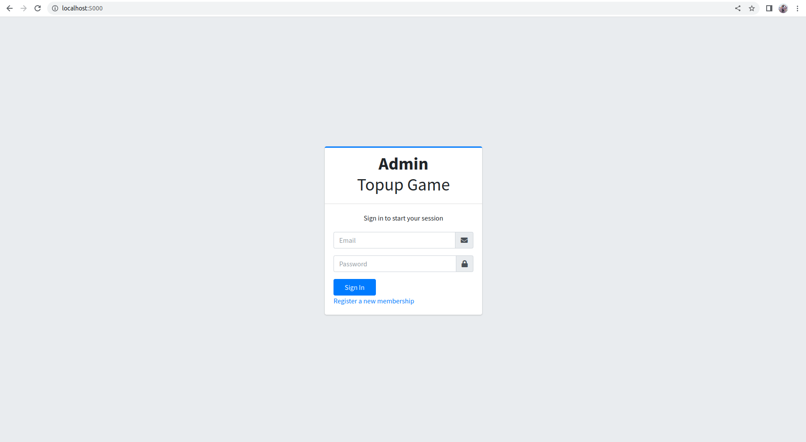
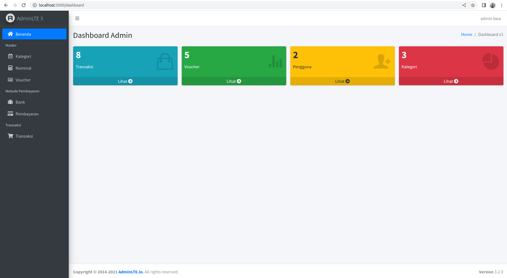
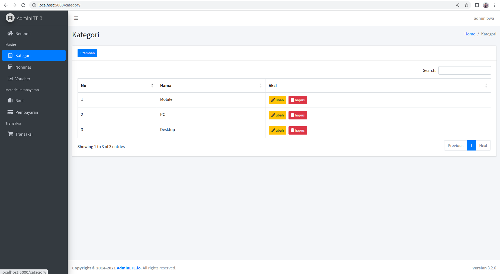
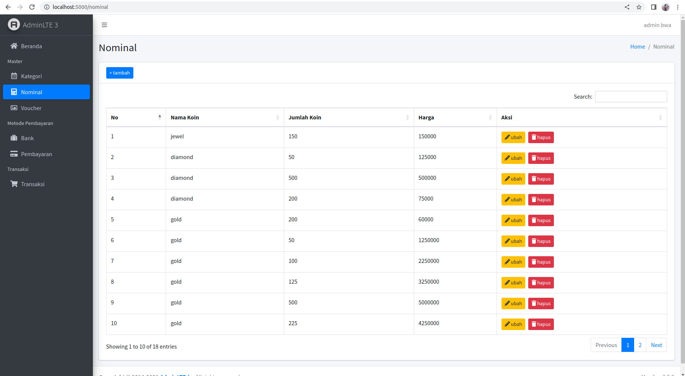
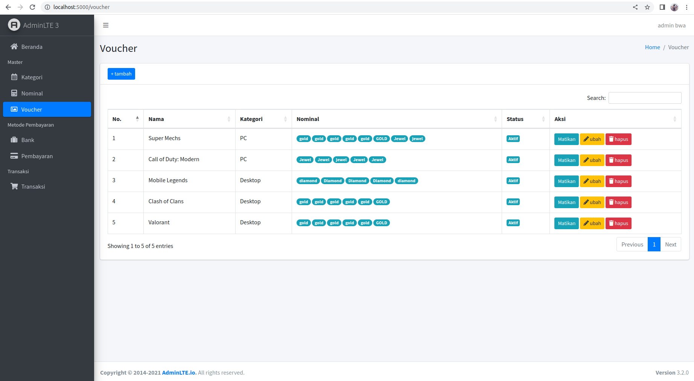
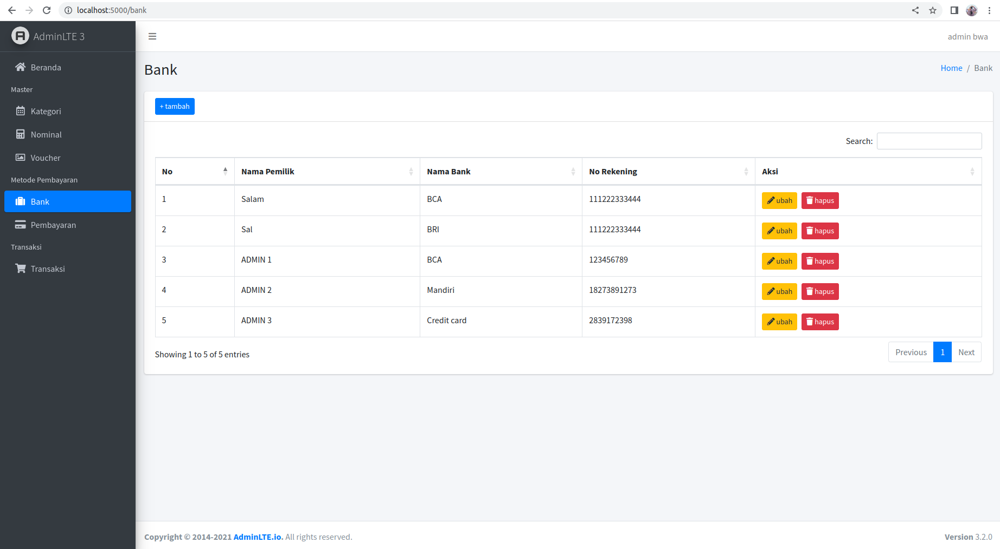
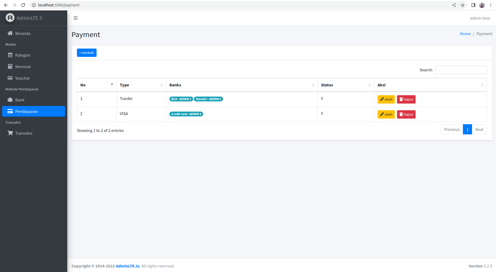
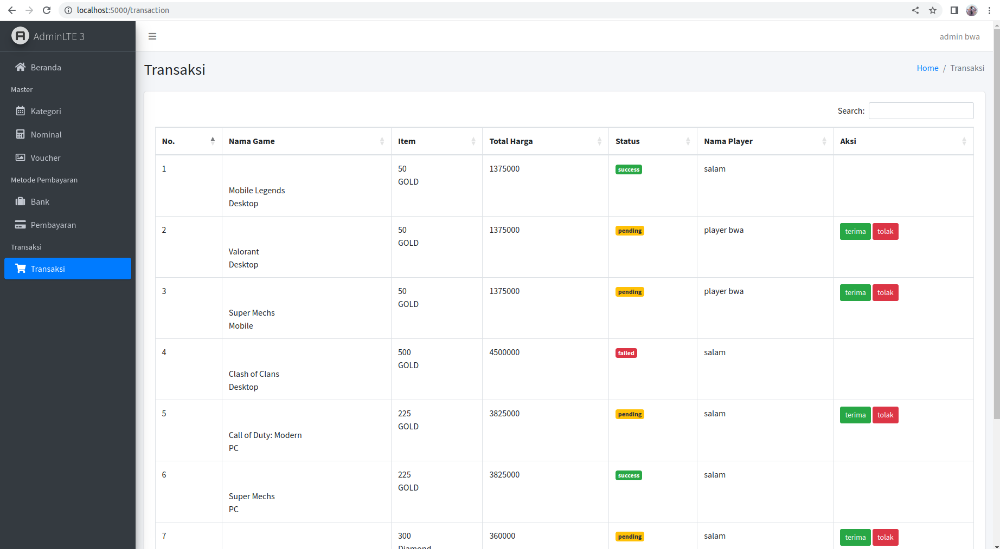

# Topup Game Admin Web App & API

This Node.js backend project supports a top-up game app and its admin dashboard. It uses Express for routing and middleware, JWT for authentication and authorization, and integrates with MongoDB to store user and game data. The project includes APIs for user auth, game transactions, leaderboard, and the admin dashboard for game management and statistics. Users can top-up their game account and track their progress through the leaderboard, providing a secure and seamless gaming experience.

## Table of Contents

- [Instalation](#instalation)
- [Import Example Data](#import-example-data)
- [API Documentation](#api-documentation)
    - [Postman Documentation](#postman-documentation)
    - [Using The APIs](#using-the-apis)
- [View Admin Page](#view-admin-page)
- [Acknowledgements](#acknowledgements)

## Installation

1. Prerequisites: 
  - Node.js (https://nodejs.org/en/download/)
  - MongoDB (https://docs.mongodb.com/manual/installation/)

2. Clone the repository: 
    `git clone https://github.com/salmaqnsGH/topup-game-be.git`

3. Install dependencies: 
    `npm install`

4. Set environment variables: 
    Create a `.env` file and set the environment variables. Use `env` file as reference.

3. Open the `.env` file and update the necessary environment variables.
    * MONGO_URL example: `mongodb://localhost:27017/topup_game` for a local database server

    * JWTKEY example: `JWTKEY=myp@ssword` set JWT key

    * PORT example: `PORT=5000` means the application will listen on port 3000 for incoming requests
    

5. Start the server: 
    `npm start`

6. Open admin dashboard: 
    Access the app in your browser at `http://localhost:[PORT]`. 
    Note: this url is also used for API base-url

## Import Example Data
You can add data manually or import provided example data here
https://drive.google.com/drive/folders/1Mv5s6D-pEDSFEZDT1gnr-DVarAQSJaWJ?usp=share_link

## API Documentation

### Postman Documentation
The Postman documentation can be found here https://documenter.getpostman.com/view/14858801/UVC2HpMb
It provides detailed information on how to interact with the API endpoints using Postman.

### Using the APIs
The following APIs are available in this project:

Base URL: `http://localhost:[PORT]`
1. User authentication API
         - POST `/api/v1/auth/signup`: Register a new user.
         - POST `/api/v1/auth/signin`: Log in an existing user.

2. Category
         - GET `/api/v1/players/category`: Get game categories

3. Profile
         - GET `/api/v1/players/profile`: Get user profile (Note: This action requires a valid JSON Web Token (JWT), so the user must first log in.)
         - PUT `/api/v1/players/profile`: Edit user profile (Note: This action requires a valid JSON Web Token (JWT), so the user must first log in.)

4. History
         - GET `/api/v1/players/history?status=pending`: Get tansaction histories (Note: This action requires a valid JSON Web Token (JWT), so the user must first log in.)
         - GET `/api/v1/players/history/[id]`: Get detail tansaction history (Note: This action requires a valid JSON Web Token (JWT), so the user must first log in.)

5. Detail
         - GET `/api/v1/players/[id]/detail`: Get detail transaction

6. Checkout
         - POST `/api/v1/players/checkout`: Checkout game

Please note that some API requests must include a valid JSON Web Token (JWT) in the header for authentication and authorization purposes.

## View Admin Page
1. Login: 
    Since admin dashboard cannot be accessed publicly, there is no register button on admin page. Register feature for admin will be developed in different page (Ongoing). For the moment, we can use generated user from provided data import [example data here](#import-example-data)

    `Email: admbwa@gmail.com`
    `Password: rahasia`
    
    
2. Dashboard
    Access statistics and track progress.
    
3. Kategori
    Manage game category
    
4. Nominal
    Manage game coin
    
5. Voucher
    Manage game voucher
    
6. Bank
    Manage bank account for payment destination
    
7. Pembayaran
    Manage payment category
    
8. Transaksi
    Validate transaction
    

## Acknowledgements

This project was developed as part of an online course on Build With Angga
